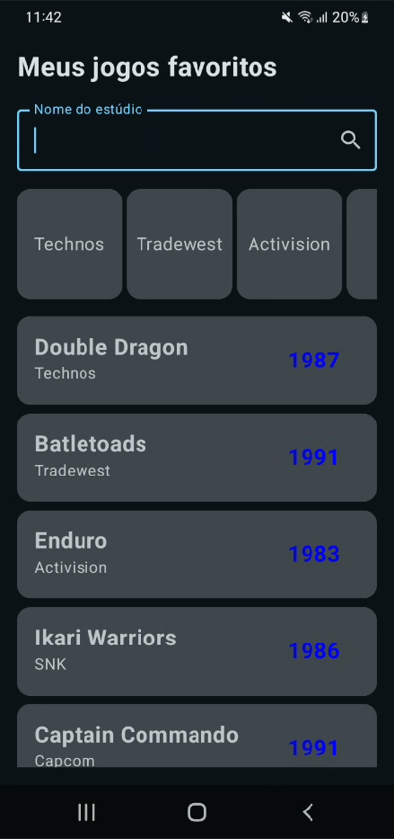
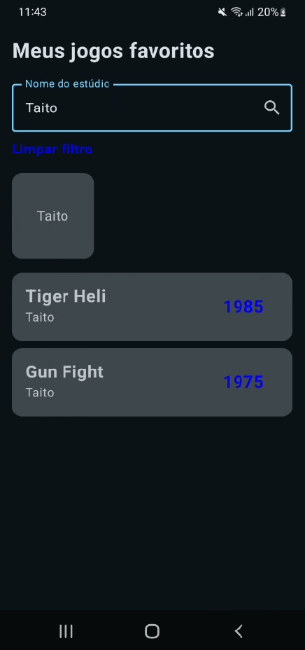

# Projeto: Fundamentos-jetpack-compose-listas-lazy

Um projeto Android com objetivo de demonstrar o uso de listas Lazy (LazyColumn e LazyRow) para exibir e filtrar jogos favoritos por estúdio.

## Tela

Funcionamento do app:


Tela inicial do app:



Tela com o filtro aplicado:



## Estrutura do projeto

```
 fundamentos-jetpack-compose-lista-lazy/
    └──app/
       ├── manifests/
       │   └── AndroidManifest.xml
       ├── kotlin+java/
       │   └── toffolipereira.com.github.fundamentos_jetpack_compose_lista_lazy/
       │       ├── components/
       │       │   ├── GameCard.kt
       │       │   └── StudioCard.kt
       │       ├── model/
       │       │   └── Game.kt
       │       ├── repository/
       │       │   └── GameList.kt
       │       ├── ui.theme/
       │       │   ├── Color.kt
       │       │   ├── Theme.kt
       │       │   └── Type.kt
       │       └── MainActivity.kt
       │
       ├── res/
       │   ├── drawable/
       │   │── mipmap/
       │   │── values/
       │   └── xml/  
       └── GradleScripts/ 
```

## Integrantes


 - Felipe Della Paschoa de Medeiros - rm98157

 - Felipe de Souza Ferreira - rm550965

 - Gabriel Iruela del Pozo - rm551425

 - Pedro Gonçalves Valle - rm98300

 - Vinicius Toffoli Pereira - rm551170


