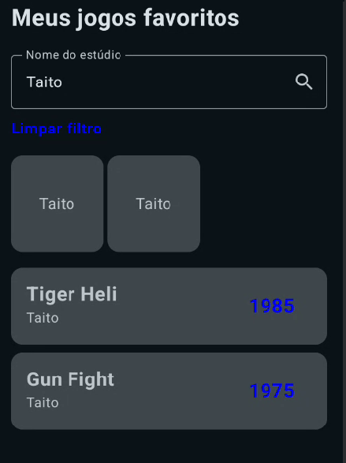
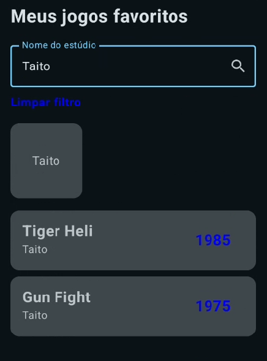

# Projeto: Fundamentos-jetpack-compose-listas-lazy

Um projeto Android com objetivo de demonstrar o uso de listas Lazy (LazyColumn e LazyRow) para exibir e filtrar jogos favoritos por estúdio.

## Tela

Funcionamento do app:


Tela inicial do app:


Tela com o filtro aplicado:


## Estrutura do projeto

```
 fundamentos-jetpack-compose-lista-lazy/
    └──app/
       ├── manifests/
       │   └── AndroidManifest.xml
       ├── kotlin+java/
       │   └── toffolipereira.com.github.fundamentos_jetpack_compose_lista_lazy/
       │       ├── components/
       │       │   ├── GameCard.kt
       │       │   └── StudioCard.kt
       │       ├── model/
       │       │   └── Game.kt
       │       ├── repository/
       │       │   └── GameList.kt
       │       ├── ui.theme/
       │       │   ├── Color.kt
       │       │   ├── Theme.kt
       │       │   └── Type.kt
       │       └── MainActivity.kt
       │
       ├── res/
       │   ├── drawable/
       │   │── mipmap/
       │   │── values/
       │   └── xml/  
       └── GradleScripts/ 
```
## Model

A model de Game:

```
data class Game(
    val id: Long = 0,
    val title: String = "",
    val studio: String = "",
    val releaseYear: Int = 0
)
```

## Repository

Na repository temos as funções:

`getAllGames()` → Pega toda a lista de Games.

```
fun getAllGames(): List<Game> {
    return listOf(
        Game(id = 1, title = "Double Dragon", studio = "Technos", releaseYear = 1987),
        Game(id = 2, title = "Batletoads", studio = "Tradewest", releaseYear = 1991),
        Game(id = 3, title = "Enduro", studio = "Activision", releaseYear = 1983),
        Game(id = 4, title = "Ikari Warriors", studio = "SNK", releaseYear = 1986),
        Game(id = 5, title = "Captain Commando", studio = "Capcom", releaseYear = 1991),
        Game(id = 6, title = "Mario Bros", studio = "Nintendo", releaseYear = 1983),
        Game(id = 7, title = "Tiger Heli", studio = "Taito", releaseYear = 1985),
        Game(id = 8, title = "Mega Man", studio = "Capcom", releaseYear = 1987),
        Game(id = 9, title = "Gradius", studio = "Konami", releaseYear = 1985),
        Game(id = 10, title = "Gun Fight", studio = "Taito", releaseYear = 1975)
    )
}
```

`getGamesByStudio(studio: String)` → Aplica um filtro nos Games de determinado studio.

```
fun getGamesByStudio(studio: String): List<Game> {
    return getAllGames().filter {
        it.studio.startsWith(prefix = studio, ignoreCase = true)
    }
}
```

## Components

Temos dois componentes:

`GameCard` → Onde é montado os Cards para cada Game.

```
@Composable
fun GameCard(game: Game) {
    Card(modifier = Modifier.padding(bottom = 8.dp)) {
        Row(
            verticalAlignment = Alignment.CenterVertically,
            horizontalArrangement = Arrangement.SpaceBetween,
            modifier = Modifier.fillMaxWidth()
        ) {
            Column(
                modifier = Modifier
                    .fillMaxWidth()
                    .padding(16.dp)
                    .weight(3f)
            ) {
                Text(
                    text = game.title,
                    fontSize = 20.sp,
                    fontWeight = FontWeight.Bold
                )
                Text(
                    text = game.studio,
                    fontSize = 14.sp,
                    fontWeight = FontWeight.Normal
                )
            }
            Text(
                text = game.releaseYear.toString(),
                modifier = Modifier
                    .weight(1f)
                    .fillMaxWidth(),
                fontSize = 20.sp,
                fontWeight = FontWeight.Bold,
                color = Color.Blue
            )
        }
    }
}
```

`StudioCard` → Onde é montado os Cards clicáveis para os Studios.

```
@Composable
fun StudioCard(game: Game, onClick: (() -> Unit)? = null) {
    Card(modifier = Modifier
        .size(100.dp)
        .padding(end = 4.dp)
        .clickable(enabled = onClick != null) { onClick?.invoke() }) {
        Column(
            verticalArrangement = Arrangement.Center,
            horizontalAlignment = Alignment.CenterHorizontally,
            modifier = Modifier.fillMaxSize()
        ) {
            Text(text = game.studio)
        }
    }
}
```

## MainActivity

Na `MainActivity` é montado a tela principal:

Barra para a pesquisa de Games através do Studio.

```
OutlinedTextField(
    value = searchTextState,
    onValueChange = { searchTextState = it },
    modifier = Modifier.fillMaxWidth(),
    label = { Text(text = "Nome do estúdio") },
    trailingIcon = {
        IconButton(onClick = { gamesListState = getGamesByStudio(searchTextState) }) {
            Icon(
                imageVector = Icons.Default.Search,
                contentDescription = ""
            )
        }
    }
)
```

Botão para limpar o filtro, ele só aparece caso esteja algum filtro aplicado.

```
if (searchTextState.isNotEmpty() || gamesListState != getAllGames()) {
    Text(
        text = "Limpar filtro",
        modifier = Modifier
            .padding(top = 8.dp)
            .fillMaxWidth()
            .clickable {
                searchTextState = ""
                gamesListState = getAllGames()
            },
        fontWeight = FontWeight.SemiBold,
        color = androidx.compose.ui.graphics.Color.Blue
    )
}
```

`val studios = gamesListState.distinctBy { it.studio }` → garante que mesmo que vários jogos tenham o mesmo estúdio, só aparece 1 vez no `LazyRow`.

Filtro sem `val studios = gamesListState.distinctBy { it.studio }`:



Filtro com `val studios = gamesListState.distinctBy { it.studio }`:



`LazyRow()` → lista de `StudioCard`, cada Card é clicável, ao clica-lo é definido o filtro no `gamesListState`.

```
val studios = gamesListState.distinctBy { it.studio }

LazyRow(){
    items(studios){ game ->
        StudioCard(game = game, onClick = {
            searchTextState = game.studio
            gamesListState = getGamesByStudio(game.studio)
        })
    }
}
```

`LazyColumn()` → traz uma lista de `GameCard`, o `gamesListState` que determina o filtro.

```
LazyColumn() {
    items(gamesListState) {
        GameCard(game = it)
    }
}
```

`GamesScreen` completa.

```
@Composable
fun GamesScreen(modifier: Modifier = Modifier) {
    var searchTextState by remember { mutableStateOf("") }
    var gamesListState by remember { mutableStateOf(getAllGames()) }

    Column(modifier = modifier.padding(16.dp)) {
        Text(
            text = "Meus jogos favoritos",
            fontSize = 24.sp,
            fontWeight = FontWeight.Bold
        )
        Spacer(modifier = Modifier.height(16.dp))
        OutlinedTextField(
            value = searchTextState,
            onValueChange = { searchTextState = it },
            modifier = Modifier.fillMaxWidth(),
            label = { Text(text = "Nome do estúdio") },
            trailingIcon = {
                IconButton(onClick = { gamesListState = getGamesByStudio(searchTextState) }) {
                    Icon(
                        imageVector = Icons.Default.Search,
                        contentDescription = ""
                    )
                }
            }
        )
        // Botão de limpar filtro
        if (searchTextState.isNotEmpty() || gamesListState != getAllGames()) {
            Text(
                text = "Limpar filtro",
                modifier = Modifier
                    .padding(top = 8.dp)
                    .fillMaxWidth()
                    .clickable {
                        searchTextState = ""
                        gamesListState = getAllGames()
                    },
                fontWeight = FontWeight.SemiBold,
                color = androidx.compose.ui.graphics.Color.Blue
            )
        }
        Spacer(modifier = Modifier.height(16.dp))

        // Extrair apenas estúdios únicos
        val studios = gamesListState.distinctBy { it.studio }

        LazyRow(){
            items(studios){ game ->
                StudioCard(game = game, onClick = {
                    searchTextState = game.studio
                    gamesListState = getGamesByStudio(game.studio)
                })
            }
        }
        Spacer(modifier = Modifier.height(16.dp))
        LazyColumn() {
            items(gamesListState) {
                GameCard(game = it)
            }
        }
    }
}
```

## Integrantes


 - Felipe Della Paschoa de Medeiros - rm98157

 - Felipe de Souza Ferreira - rm550965

 - Gabriel Iruela del Pozo - rm551425

 - Pedro Gonçalves Valle - rm98300

 - Vinicius Toffoli Pereira - rm551170


